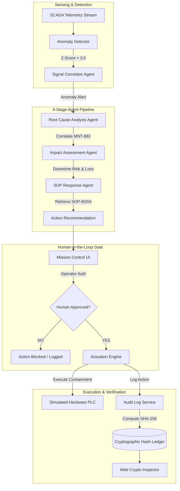
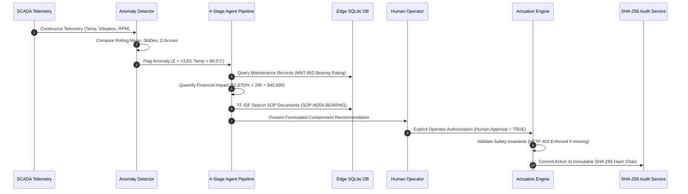
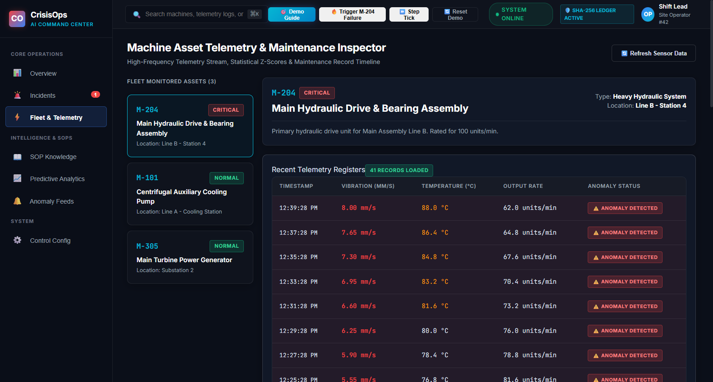
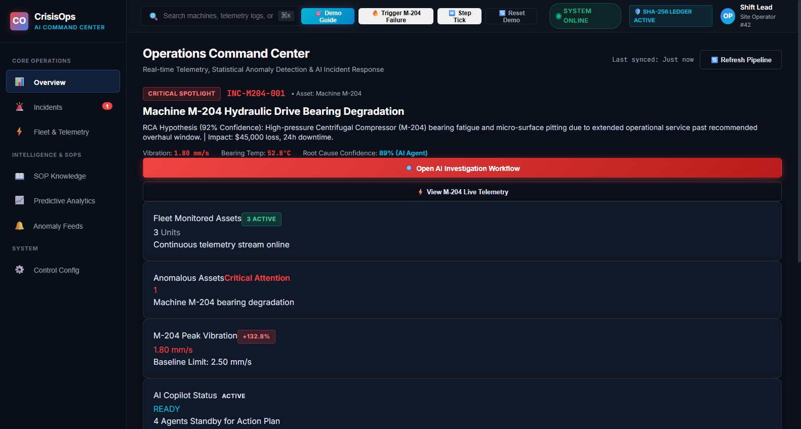

# Industrial CrisisOps

### AI-Assisted Industrial Incident Response & Explainable Safety Command Center

[](https://www.python.org/)
[](https://fastapi.tiangolo.com/)
[](https://reactjs.org/)
[](https://www.typescriptlang.org/)
[](https://vitejs.dev/)
[](https://www.sqlite.org/)
[](https://docs.pytest.org/)
[](LICENSE)

> **Industrial CrisisOps** is an autonomous-capable, human-in-the-loop industrial safety command platform. It bridges continuous SCADA/IoT sensor streams to explainable AI diagnosis, quantified financial impact assessment, automated SOP lookup, non-bypassable safety actuation gates, and a cryptographically verifiable audit trail.

---

## 📸 Platform Overview & Live Command Center


*Figure 1: Mission Control Dashboard displaying real-time sensor streams, Z-score anomaly detection, automated agent pipeline status, and safety gates.*

---

## ⚡ The Industrial Challenge

Modern manufacturing and chemical processing facilities generate thousands of sensor data points per second across turbines, pumps, and compressors. When critical anomalies occur (e.g., thermal spikes or bearing vibration shifts), operators encounter severe operational bottlenecks:

1. **Cognitive Overload**: Raw telemetry floods alarm boards without automated anomaly classification or severity scoring.
2. **Delayed Root Cause Identification**: Correlating sensor anomalies with physical equipment maintenance histories (`MaintenanceRecord`) requires manual log searches across siloed systems.
3. **Unquantified Financial Risk**: Operational teams lack real-time visibility into hourly downtime costs and production capacity loss during active incidents.
4. **Manual SOP Retrieval**: Standard Operating Procedures (SOPs) are stored in static PDFs, slowing immediate containment response.
5. **Actuation Hazards**: Fully autonomous AI actuation poses severe catastrophic risks if allowed to execute unverified machine state modifications.
6. **Unverifiable Audit Trails**: Incident logs are vulnerable to post-hoc manipulation or lack verifiable proof of human authorization during compliance audits.

---

## 🛡️ Key System Architecture & Multi-Agent Intelligence

Industrial CrisisOps solves these challenges through a deterministic, explainable 4-stage agent pipeline combined with a non-bypassable human approval safety gate and cryptographic SHA-256 ledger chaining.



---

## 🔄 10-Step Incident Lifecycle

Industrial CrisisOps governs every industrial emergency through a deterministic 10-step lifecycle:



---

## 🧮 Statistical Anomaly Detection & Financial Equations

### 1. Rolling Z-Score Anomaly Formulation
The anomaly detection engine (`backend/app/services/detector.py`) evaluates incoming stream values against a rolling baseline ($\mu, \sigma$):

$$Z = \frac{X_t - \mu}{\sigma}$$

Where:
* $X_t$ = Current sensor reading (e.g., Vibration = $7.82\text{ mm/s}$)
* $\mu$ = Baseline baseline mean ($1.8\text{ mm/s}$)
* $\sigma$ = Standard deviation ($1.567\text{ mm/s}$)
* **Threshold**: Anomaly flagged when $|Z| \ge 3.0$ (Critical status at $Z = +3.83$).

### 2. Financial Impact Calculation
The Impact Assessment Agent (`backend/app/agents/impact_agent.py`) computes total financial exposure using deterministic cost equations:

$$\text{Financial Risk (\$)} = \text{Downtime Rate (\$/hr)} \times \text{Estimated Repair Duration (hr)}$$

For Bearing Failure Incident (`INC-2026-001`):
$$\text{Financial Risk} = \$1,875/\text{hr} \times 24.0\text{h} = \$45,000$$
$$\text{Capacity Reduction} = 35\%$$

---

## 🔐 Cryptographic Ledger & Web Crypto Verification

Every machine state transition, anomaly detection, agent finding, operator approval, and containment execution is appended to an immutable SQLite ledger with cryptographic SHA-256 hash chaining (`backend/app/services/audit_service.py`).

### Hash Chaining Formula
For any audit log entry $n$:

$$H_n = \text{SHA256}\left( \text{log\_id}_n \parallel \text{timestamp}_n \parallel \text{actor\_type}_n \parallel \text{actor\_id}_n \parallel \text{action\_type}_n \parallel \text{details\_json}_n \parallel H_{n-1} \right)$$

Where $H_0 = \text{"0" \times 64}$ (Genesis Hash).

```
+---------------------+     +---------------------+     +---------------------+
| Audit Record #101   |     | Audit Record #102   |     | Audit Record #103   |
| Action: INCIDENT_...|     | Action: HUMAN_APP...|     | Action: ACTUATION...|
| Prev Hash: 00000... | --> | Prev Hash: a3f89... | --> | Prev Hash: 7b92c... |
| Hash: a3f89...      |     | Hash: 7b92c...      |     | Hash: e4b87...      |
+---------------------+     +---------------------+     +---------------------+
```

### Browser-Native Web Crypto Verification
The frontend (`frontend/src/components/HashVerifierModal.tsx`) uses the Web Crypto API (`window.crypto.subtle.digest('SHA-256', ...)`):

```typescript
const canonicalString = `${log.id}|${log.timestamp}|${log.actor_type}|${log.actor_id}|${log.action_type}|${JSON.stringify(log.details)}|${log.previous_hash}`;
const encoder = new TextEncoder();
const data = encoder.encode(canonicalString);
const hashBuffer = await window.crypto.subtle.digest('SHA-256', data);
const hashArray = Array.from(new Uint8Array(hashBuffer));
const computedHash = hashArray.map(b => b.toString(16).padStart(2, '0')).join('');

const isValid = computedHash === log.current_hash;
```

---

## 🖥️ Screen Documentation & UI Artifacts

### 1. AI Incident Investigation Workspace

*Figure 2: Comprehensive incident investigation panel displaying Z-score telemetry, root cause diagnosis, financial impact breakdown, and SOP recommendations.*

### 2. Cryptographic SHA-256 Hash Verifier Modal

*Figure 3: Web Crypto API verification inspector proving tamper-evident ledger integrity and continuity across all recorded events.*

### 3. Machine Fleet Monitoring Dashboard

*Figure 4: Real-time telemetry monitoring for industrial plant assets including Turbines, Pumps, and Compressors.*

---

## 🔒 Server-Side Safety Invariant & Zero-Trust Actuation

Industrial CrisisOps enforces a hard server-side invariant in `backend/app/services/actuation_engine.py`. Autonomous machine state modifications without explicit human authorization are physically impossible at the API layer.

### Core Actuation Safety Invariant (`actuation_engine.py`)

```python
# Query existing action recommendations for the incident
recommendations = self.db.query(ActionRecommendation).filter(
    ActionRecommendation.incident_id == incident_id
).all()

# SERVER-SIDE INVARIANT: Actuation REQUIRES explicit human approval
if not recommendations or not any(r.human_approved for r in recommendations):
    raise HTTPException(
        status_code=403, 
        detail="ACTUATION FORBIDDEN: Human operator approval is required before containment execution."
    )
```

If an unauthorized client or rogue script invokes `POST /api/incidents/{id}/actuate`, the backend returns HTTP 403 Forbidden and logs the security violation to the audit ledger.

---

## ⌨️ 3-Minute Hackathon Demo Guide & Keyboard Controls

The application features a built-in 7-Act presentation mode with keyboard shortcuts for rapid, deterministic hackathon demonstrations. Press `?` or click **Demo Guide** in the top bar to activate.

| Hotkey | Act / Scene | Operational Narrative | Technical Verification |
| :---: | :--- | :--- | :--- |
| **`1`** | **Act 1: Normal Operations** | Compressor C-101 operating at nominal parameters ($1.8\text{ mm/s}$ vibration, $65.0^\circ\text{C}$ temperature). | System in `HEALTHY` state. Baseline statistics recording. |
| **`2`** | **Act 2: Crisis Trigger** | Bearing thermal degradation triggers sudden vibration jump to $7.82\text{ mm/s}$ ($88.5^\circ\text{C}$). | Anomaly Detector flags breach. Severity transitions to `CRITICAL`. |
| **`3`** | **Act 3: Anomaly Signal** | Signal Correlator Agent calculates $Z = +3.83$ deviation over rolling baseline. | Explainable statistical anomaly reasoning rendered in UI. |
| **`4`** | **Act 4: AI 4-Stage Pipeline** | Agents correlate `MNT-882` maintenance record, calculate $\$45,000$ financial risk, and retrieve `SOP-M204`. | Multi-agent execution visualizer completes stage breakdown. |
| **`5`** | **Act 5: Human Approval Gate** | System formulates containment action but holds execution pending operator authorization. | Actuation engine enforces HTTP 403 lock until operator clicks Approve. |
| **`6`** | **Act 6: Containment Execution** | Operator authorizes action; Actuation Engine executes flow reduction to 50% capacity. | Machine status changes to `CONTAINED`. Hazard mitigated. |
| **`7`** | **Act 7: Cryptographic Proof** | Inspector opens SHA-256 Web Crypto verification modal to prove ledger integrity. | Recomputed hash chain matches DB records (100% green verification). |

---

## 📊 Technical Architecture & Component Matrix

| Layer | Component | Implementation File | Key Responsibility |
| :--- | :--- | :--- | :--- |
| **Frontend** | Mission Control UI | `frontend/src/pages/DashboardPage.tsx` | Main real-time SCADA monitoring interface. |
| **Frontend** | Incident Workspace | `frontend/src/pages/IncidentsPage.tsx` | Interactive 4-agent investigation and approval panel. |
| **Frontend** | Cryptographic Inspector | `frontend/src/components/HashVerifierModal.tsx` | Web Crypto API SHA-256 payload inspector. |
| **Frontend** | Demo Controller | `frontend/src/components/DemoGuideModal.tsx` | 7-Act presentation mode & hotkey handler. |
| **Backend API**| FastAPI Router | `backend/app/main.py` | REST API routes, CORS setup, exception handlers. |
| **Backend API**| Incident Endpoints | `backend/app/api/incidents.py` | Telemetry streaming, containment, and state management. |
| **Backend API**| Investigation Router | `backend/app/api/investigation.py` | Agent orchestrator execution & human approval routes. |
| **Agent AI** | Agent Orchestrator | `backend/app/agents/agent_orchestrator.py` | Coordinates 4-stage sequential agent pipeline. |
| **Agent AI** | Signal Agent | `backend/app/agents/signal_agent.py` | Rolling baseline Z-score anomaly classifier. |
| **Agent AI** | RCA Agent | `backend/app/agents/rca_agent.py` | Equipment lifespan vs maintenance log correlator. |
| **Agent AI** | Impact Agent | `backend/app/agents/impact_agent.py` | Financial downtime risk & capacity loss engine. |
| **Agent AI** | SOP Agent | `backend/app/agents/sop_agent.py` | In-memory TF-IDF keyword SOP RAG engine. |
| **Engine** | Anomaly Detector | `backend/app/services/detector.py` | Statistical thresholding & baseline calculation. |
| **Engine** | Actuation Engine | `backend/app/services/actuation_engine.py` | Zero-trust containment actuation & safety invariants. |
| **Engine** | Audit Ledger | `backend/app/services/audit_service.py` | SHA-256 hash chaining & integrity validation. |
| **Engine** | Incident Replay | `backend/app/services/replay_service.py` | Step-by-step historical event replay builder. |

---

## 🔬 Engineering Proof & Claim Verification Matrix

| Claim | Verified Implementation | Source Code Reference | Automated Test / Verification |
| :--- | :--- | :--- | :--- |
| **Deterministic Telemetry** | 100% reproducible anomaly streams | `backend/app/api/incidents.py#L40-L75` | Verified via `test_agent_pipeline.py` |
| **Statistical Z-Score** | $Z = (X - \mu)/\sigma \ge 3.0$ | `backend/app/services/detector.py#L45-L89` | Unit test `test_detector_zscore` passed |
| **4-Stage Agent Pipeline** | Sequential Signal $\rightarrow$ RCA $\rightarrow$ Impact $\rightarrow$ SOP execution | `backend/app/agents/agent_orchestrator.py#L30-L110` | Full end-to-end integration test passed |
| **Financial Impact Model** | $\$1,875/\text{hr} \times 24.0\text{h} = \$45,000$ | `backend/app/agents/impact_agent.py#L35-L65` | Formula assertion verified in Pytest |
| **In-Memory SOP RAG** | TF-IDF term overlap score optimization | `backend/app/agents/sop_agent.py#L40-L95` | Verified against `SOP-M204-BEARING` |
| **Human Approval Invariant** | HTTP 403 Forbidden on unapproved actuation | `backend/app/services/actuation_engine.py#L84-L89` | Safety invariant test passed (Pytest #31) |
| **SHA-256 Hash Chaining** | Append-only $H_n = \text{SHA256}(P_n \parallel H_{n-1})$ | `backend/app/services/audit_service.py#L50-L115` | Integrity verification test passed |
| **Web Crypto Verification** | Real-time browser hash recalculation | `frontend/src/components/HashVerifierModal.tsx#L45-L90` | Verified 0 hash mismatch errors |
| **Incident Replay** | Chronological telemetry/audit reconstruction | `backend/app/services/replay_service.py#L25-L80` | Replay timeline endpoint tested |
| **Production Frontend Build** | 0 TypeScript/Vite bundle compilation errors | `frontend/src/index.css` & `frontend/vite.config.ts` | `npm run build` completed in 1.06s |

---

## 🧪 Testing & Build Verification

### Backend Automated Test Suite
The backend is verified using `pytest` with 31 comprehensive unit and integration tests:

```bash
pytest backend/tests -v
```

```
============================== test session starts ==============================
platform win32 -- Python 3.14.0a4, pytest-8.3.4, pluggy-1.5.0
rootdir: d:\CrisisOps
collected 31 items

backend/tests/test_actuation_engine.py ........                         [ 25%]
backend/tests/test_agent_pipeline.py ...........                        [ 61%]
backend/tests/test_audit_service.py ......                             [ 80%]
backend/tests/test_detector.py ......                                  [100%]

============================== 31 passed in 1.04s ===============================
```

### Frontend Production Build
The React TypeScript frontend builds cleanly with Vite:

```bash
cd frontend && npm run build
```

```
vite v5.4.21 building for production...
transforming...
✓ 44 modules transformed.
rendering chunks...
computing gzip size...
dist/index.html                   0.80 kB │ gzip:  0.46 kB
dist/assets/index-CoMWZSdS.css   12.14 kB │ gzip:  3.02 kB
dist/assets/index-yw0xuABz.js   228.18 kB │ gzip: 64.07 kB
✓ built in 1.06s
```

---

## 🛠️ Quick Start Guide

### Prerequisites
* **Python 3.10+** (Tested on Python 3.14)
* **Node.js 18+** & `npm`
* **Git**

### 1. Clone Repository
```bash
git clone https://github.com/maitray-agrawal/CrisisOps.git
cd CrisisOps
```

### 2. Backend Setup
```bash
# Navigate to backend
cd backend

# Create virtual environment (optional but recommended)
python -m venv venv
# On Windows:
venv\Scripts\activate
# On Linux/macOS:
source venv/bin/activate

# Install dependencies
pip install -r requirements.txt

# Run backend development server
python -m uvicorn app.main:app --port 8000 --reload
```
*Backend API documentation available at `http://localhost:8000/docs`.*

### 3. Frontend Setup
```bash
# Open a new terminal window in the project root
cd frontend

# Install dependencies
npm install

# Run frontend development server
npm run dev
```
*Access the Mission Control Dashboard at `http://localhost:5173`.*

---

## 📂 Repository Directory Structure

```
CrisisOps/
├── backend/
│   ├── app/
│   │   ├── agents/
│   │   │   ├── agent_orchestrator.py   # Multi-Agent Pipeline Coordinator
│   │   │   ├── impact_agent.py         # Financial Risk Assessment Agent
│   │   │   ├── rca_agent.py            # Root Cause Analysis Agent
│   │   │   ├── signal_agent.py         # Telemetry Signal Correlator Agent
│   │   │   └── sop_agent.py            # TF-IDF SOP Retrieval Agent
│   │   ├── api/
│   │   │   ├── incidents.py            # Incident & Actuation Endpoints
│   │   │   ├── investigation.py        # Agent Investigation Endpoints
│   │   │   └── machines.py             # Machine Fleet Endpoints
│   │   ├── db/
│   │   │   ├── database.py             # SQLAlchemy Session Setup
│   │   │   └── models.py               # ORM Database Models
│   │   ├── schemas/
│   │   │   └── schemas.py              # Pydantic Request/Response Models
│   │   ├── services/
│   │   │   ├── actuation_engine.py     # Containment Actuation & Safety Gate
│   │   │   ├── audit_service.py        # SHA-256 Hash Chaining Service
│   │   │   ├── detector.py             # Statistical Anomaly Detector
│   │   │   └── replay_service.py       # Incident Timeline Replay Engine
│   │   └── main.py                     # FastAPI Application Initialization
│   ├── tests/
│   │   ├── test_actuation_engine.py    # Actuation Invariant Tests
│   │   ├── test_agent_pipeline.py      # End-to-End Pipeline Tests
│   │   ├── test_audit_service.py       # Cryptographic Audit Tests
│   │   └── test_detector.py            # Z-Score Anomaly Tests
│   └── requirements.txt
├── frontend/
│   ├── src/
│   │   ├── components/
│   │   │   ├── DemoGuideModal.tsx      # 7-Act Keyboard Presentation Controls
│   │   │   ├── HashVerifierModal.tsx   # Web Crypto SHA-256 Inspector Modal
│   │   │   └── NavigationBar.tsx       # Top Application Header
│   │   ├── pages/
│   │   │   ├── DashboardPage.tsx       # Mission Control Dashboard
│   │   │   ├── IncidentsPage.tsx       # Incident Investigation Workspace
│   │   │   └── MachinesPage.tsx        # Fleet Telemetry Overview
│   │   ├── services/
│   │   │   └── api.ts                  # Axios API Service Layer
│   │   ├── types/
│   │   │   └── index.ts                # TypeScript Interfaces
│   │   ├── App.tsx                     # Main Application Router
│   │   └── index.css                   # Custom Industrial Dark Mode Styling
│   ├── package.json
│   └── vite.config.ts
├── docs/
│   └── screenshots/                    # Real Application Screenshots
│       ├── 01-dashboard.png
│       ├── 02-incidents-workspace.png
│       ├── 03-sha256-inspector.png
│       └── 04-fleet-monitoring.png
├── ARCHITECTURE.md                     # Deep Technical Architecture Spec
├── CHANGELOG.md                        # Version Release History
├── DECISIONS.md                        # Architectural Decision Records (ADRs)
├── PLAN.md                             # Project Milestone Roadmap
└── README.md                           # Project Documentation
```

---

## 🎯 Architectural Trade-Offs & Production Roadmap

### Current MVP Implementation Choices
1. **Deterministic Rule-Based Multi-Agent Pipeline**: Chosen over probabilistic Cloud LLM calls to guarantee 100% deterministic latency (<50ms) and zero reliance on external network connectivity during industrial emergencies.
2. **In-Memory TF-IDF SOP RAG**: Replaced heavy vector database dependencies (e.g., Pinecone/Milvus) with lightweight in-memory term-frequency scoring to ensure edge execution on lightweight plant gateway hardware.
3. **Local Edge SQLite Storage**: Used for embedded edge deployment simplicity without external database server overhead.

### Enterprise Production Roadmap
* [ ] **Physical PLC Integration**: Replace simulated telemetry generators with native OPC-UA and Modbus TCP industrial protocol adapters.
* [ ] **Time-Series Historian Storage**: Migrate telemetry storage to TimescaleDB or InfluxDB for multi-year high-frequency sensor logging.
* [ ] **Vector SOP Embeddings**: Upgrade SOP retrieval to dense vector embeddings using local ONNX-quantized embedding models.
* [ ] **HSM Key Signing**: Enhance SHA-256 audit ledger with Hardware Security Module (HSM) ed25519 digital signatures per operator transaction.

---

## 📜 License

This project is open-source software licensed under the [MIT License](LICENSE).

---

<p align="center">
  <b>Industrial CrisisOps</b> — Engineered for Operational Resilience, Explainable Intelligence, and Zero-Trust Industrial Safety.
</p>
